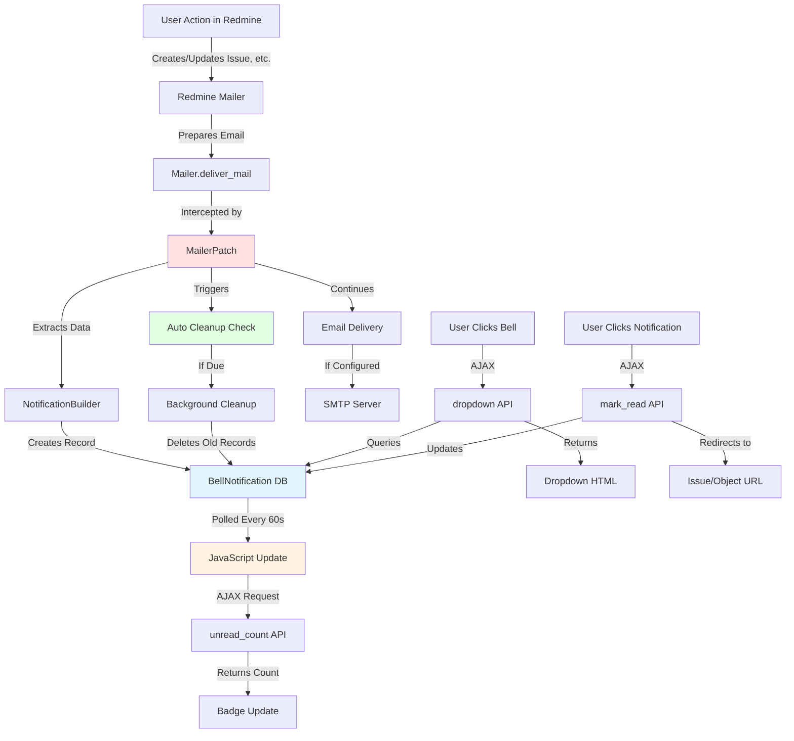
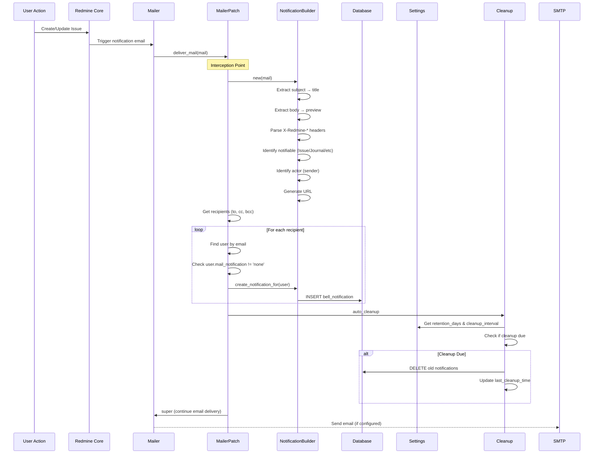
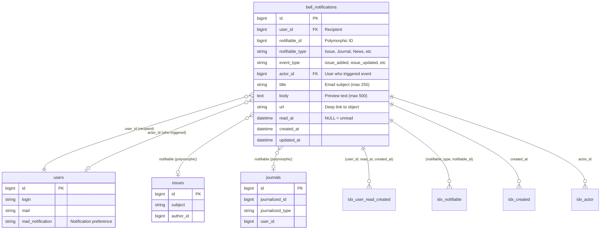
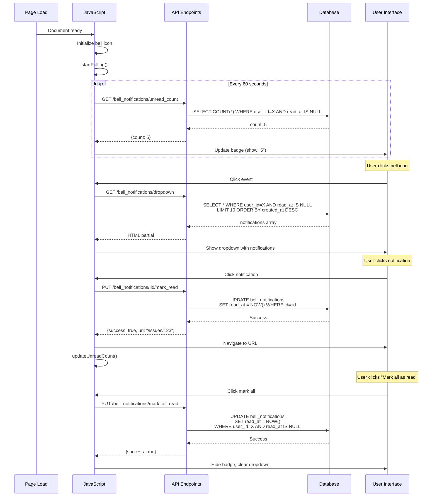
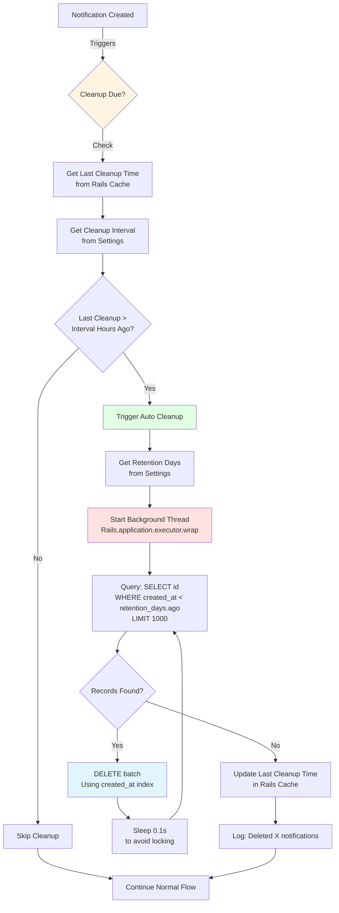

# 🔔 Redmine Bell Notifications

An in-app notification system for Redmine 6+ that adds a bell icon to the header with a dropdown showing recent notifications. Notifications follow the same rules and preferences as email notifications.

The plugin intercepts Redmine's email notification system and creates in-app bell notifications from the same events that trigger emails. This means notifications work independently of email delivery - even if SMTP is not configured, you'll still get in-app notifications for issues, updates, comments, @mentions, and more.

## Features

- **Bell icon** in the header with unread count badge
- **Dropdown** showing latest unread notifications (configurable: 5-50)
- **Auto-updates** badge count every 60 seconds
- **Click notification** to navigate to the issue/object and mark as read or **Mark all as read**
- **Follows email notification preferences** - respects user's notification settings
- **Popular theme-compatible** - uses Redmine's native CSS classes and color scheme, (tested with themes classic, alternate, PurpleMine, etc.)
- **Automatic data management** - configurable retention period (15-365 days), notification data retention in database.
- **Mobile-responsive** design

> **⚠️ IMPORTANT: This plugin is entirely developed using AI tools including GitHub Copilot and Claude. Please review the code and test thoroughly before using in production.**

## Compatibility

Supported Redmine versions:

- Redmine 6.x
- Redmine 7.0.x

Verified with Redmine 7.0.0.stable / Ruby 4.0.5-p0 / Rails 8.1.3.


 

## Installation

### 1. Install the Plugin

```bash
cd /path/to/redmine/plugins
git clone https://github.com/Akshaychdev/redmine_bell_notifications
```

Or download and extract to `plugins/redmine_bell_notifications/`,
The plugin directory must be named exactly `redmine_bell_notifications` to match the plugin registration. Do not rename it.

### 2. Run Database Migration

```bash
cd /path/to/redmine

bundle install && \
bundle exec rake redmine:plugins:migrate RAILS_ENV=production
```

### 3. Restart Redmine

```bash
# If using Passenger
touch tmp/restart.txt

# If using systemd
sudo systemctl restart redmine

# If using Docker
docker restart <container_name>
```

### 4. Configure Settings (Optional)

Automatic cleanup and dropdown limit can be configured:

- **Dropdown limit**: Number of notifications to show (5-50), default 10 (max 10 unread and 10 read)
- **Retention period**: How long to keep notifications (15-365 days), default 30 days
- **Cleanup interval**: How often to run cleanup (1-168 hours), default 24 hours

Access settings at: **Administration > Plugins > Redmine Bell Notifications > Configure**

## Usage

Once installed, logged-in users will see a bell icon (🔔) in the header:

- **Desktop**: After the project switcher in the header
- **Mobile**: Next to the hamburger menu (☰) in the top-right corner

Click any notification to navigate to the issue/object (marks as read automatically), Click "Mark all as read" to move all notifications to read.

**Notification Badge:**

Shows the count of unread notifications, updates every 60 seconds, displays "99+" if you have more than 99 unread notifications

**Notification Rules:**

- Bell notifications follow the same rules as email notifications
- Users with email notifications set to "none" will NOT receive bell notifications
- Notifications are created for all events that would trigger an email:
  - New issues
  - Issue updates
  - New comments
  - Assignments
  - @mentions
  - Wiki updates
  - News posts
  - Forum messages

**Data Management:**

- The plugin **automatically cleans up old notifications** based on your configured interval (default: every 24 hours)
- Deletes notifications older than the retention period (default: 180 days)
- Manual cleanup is also available:

  ```bash
  rake redmine:bell_notifications:cleanup RAILS_ENV=production

  # Delete notifications older than 90 days
  DAYS=90 rake redmine:bell_notifications:cleanup RAILS_ENV=production
  ```

- View notification statistics:

  ```bash
  rake redmine:bell_notifications:stats RAILS_ENV=production
  ```

### How It Works

1. **Mailer Interception**: The plugin patches Redmine's `Mailer.deliver_mail` method
2. **Notification Creation**: The plugin creates a `BellNotification` record for each recipient whenever Redmine prepares to send an email
3. **Independent Operation**: Bell notifications are created **regardless of email delivery settings** - they work even when:
   - Email credentials are not configured
   - Email delivery is disabled in Redmine settings
   - SMTP server is unavailable
4. **No Impact on Emails**: Email delivery continues normally (if configured) - the plugin only adds in-app notifications
5. **Data Extraction**: Notification data is extracted from the email object:
   - Subject becomes the title
   - Body becomes the preview text
   - Mail headers identify the related issue/object
   - Recipients determine who gets notifications



#### 2. Mailer Interception & Notification Creation

Detailed flow of how emails are intercepted and converted to bell notifications:



#### 3. Database Schema & Relationships

Visual representation of the `bell_notifications` table and its relationships:



**Key Indices:**

1. **`(user_id, read_at, created_at)`** - Composite index for fast unread queries
2. **`(notifiable_type, notifiable_id)`** - Polymorphic lookups
3. **`created_at`** - Cleanup queries (deleting old records)
4. **`actor_id`** - Foreign key with ON DELETE SET NULL

#### 4. Dropdown Population & User Interaction

Frontend JavaScript flow for displaying and interacting with notifications:



#### 5. Automatic Cleanup Mechanism

**Cleanup Flow Details:**

1. **Trigger**: Every notification creation checks if cleanup is due
2. **Cache Check**: Reads `bell_notifications_last_cleanup` timestamp from Rails cache
3. **Settings**: Gets `retention_days` (15-365) and `cleanup_interval` (1-168 hours) from plugin settings
4. **Background Execution**: Uses `Rails.application.executor.wrap` for thread-safe background processing
5. **Batch Processing**: Deletes 1000 records at a time to avoid long-running locks
6. **Performance**: Uses `created_at` index for fast queries, sleeps between batches
7. **Completion**: Updates cache timestamp to prevent duplicate runsages old notifications without cron jobs:



## Troubleshooting

### Bell icon not appearing

1. Clear browser cache and hard reload (Ctrl+F5)
2. Check that you're logged in (bell only shows for logged-in users)
3. Check browser console for JavaScript errors
4. Verify plugin is installed: `ls plugins/redmine_bell_notifications`
5. Restart Redmine after installation

### Notifications not appearing

1. Verify user's email notification setting is NOT set to "none" (respects user privacy)
2. Check Rails logs: `tail -f log/production.log`
3. Look for errors in the BellNotifications namespace
4. Verify the plugin migration has been run: `rake redmine:plugins:migrate RAILS_ENV=production`

### Dropdown not opening

1. Check browser console for JavaScript errors
2. Verify assets are loaded: View page source and search for `bell_notifications.js`
3. Try disabling other plugins temporarily to check for conflicts

### Performance issues

1. Run cleanup task to reduce table size
2. Consider reducing retention period if table is very large

## Uninstall Plugin

### 1. Rollback Database Migration

```bash
cd /path/to/redmine
bundle exec rake redmine:plugins:migrate NAME=redmine_bell_notifications VERSION=0 RAILS_ENV=production
```

### 2. Remove Plugin Directory

```bash
rm -rf plugins/redmine_bell_notifications
```

Restart Redmine

## Development

### Running Tests

The plugin includes a test suite covering:

- **Unit tests**: Models, notification builder, mailer patch
- **Functional tests**: Controllers and API endpoints
- **Integration tests**: Full request/response cycles

**Run all tests:**

```bash
cd /path/to/redmine
bundle exec rake redmine:plugins:test NAME=redmine_bell_notifications RAILS_ENV=test
```

**Run specific test file:**

```bash
cd /path/to/redmine
bundle exec rails test plugins/redmine_bell_notifications/test/unit/bell_notification_test.rb RAILS_ENV=test
```

**Run specific test:**

```bash
cd /path/to/redmine
bundle exec rails test plugins/redmine_bell_notifications/test/unit/bell_notification_test.rb:10 RAILS_ENV=test
```

**Test coverage:**

- Model validations and associations
- Notification creation from emails
- Controller actions and API responses
- Permission handling
- Mark as read functionality
- Cleanup tasks

### File Structure

```shell
redmine_bell_notifications/
├── init.rb                          # Plugin registration
├── app/
│   ├── controllers/                 # Controllers
│   ├── models/                      # Models
│   └── views/                       # Views
├── assets/                          # JS, CSS, images
├── config/                          # Routes, locales
├── db/migrate/                      # Migrations
├── lib/                             # Core logic, patches
└── test/                            # Tests
```

## Contributing

Contributions are welcome! Please:

1. Fork the repository
2. Create a feature branch
3. Make your changes
4. Add tests if applicable
5. Submit a pull request

## License

This plugin is licensed under the MIT License.

## Support

For issues, feature requests, or questions:

- GitHub Issues: <https://github.com/Akshaychdev/redmine_bell_notifications/issues>
- Email: <akshaych.dev@gmail.com>

## Changelog

### Version 1.0.0 (2025-12-27)

- Initial release
- Bell icon with unread count badge
- Dropdown with latest 10 notifications
- Auto-update every 60 seconds
- Mark as read functionality
- Mark all as read functionality
- Automatic cleanup task (6-month retention)
- Theme-compatible design
- Mobile-responsive layout

## Roadmap

Future enhancements may include:

- Full notification page (in addition to dropdown)
- Real-time updates via WebSockets/ActionCable
- Per-event notification preferences
- Search and filtering
- Sound/desktop notifications
- Notification archiving
